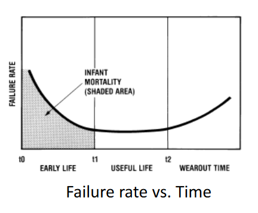
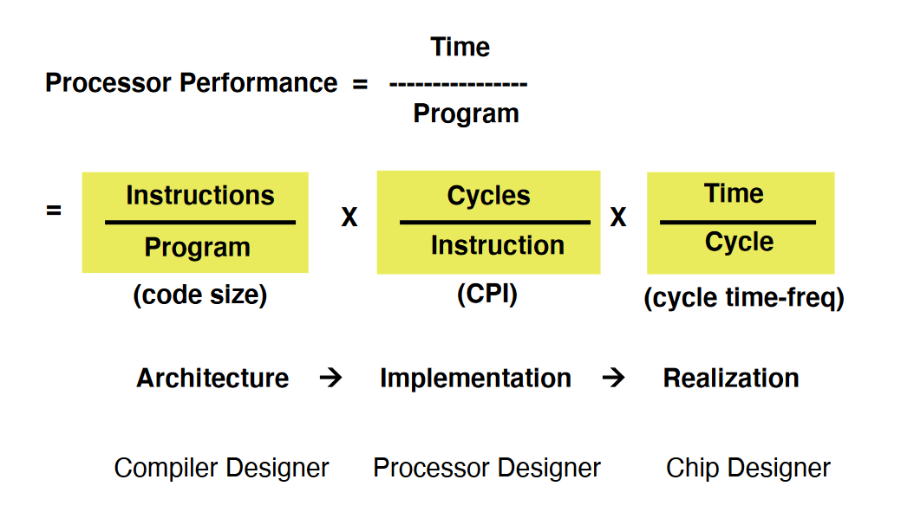

# Learning Objectives

* Review Fundamental operation of transistor and CMOS
* Understand How ICs are manufactured
* Identify and understand computer metrics
  * Cost
  * Performance
  * Power
  * Reliability
* Review Main Structure of Computer taxonomies  
* Learn about standard Computer Benchmarks

## Metrics

Cost of IC's depend on this:  
Area  
Testing Cost  
Package Type  

## Die Cost

  
 

 

 

 
n = measure of manufacturing process complexity

e.g. Calculate yield for IC with
area = 160mm,
defect density of 0.05cm
wafer yield of 91%
n=5
wafer cost = $6600

Dies per wafer = pi*r^2 / (die area) - (2pi*r)/(sqrt(2*die area)) = 161
yield = 0.91/(1+0.05* 1.6)^5 = 62%

Good dies per wafer = yield *dies per wafer = 62%*161 = 99.82
IC Cost = wafer cost / good dies per wafer = $6600/99.82= $66.11

## Wafer Size

300mm/200mm = 1.5, area=pi(r)^2
area of 300 mm wafer is larger than 200mm, by a factor of 1.5^2 = 2.25 on same wafer

## Cost Of Testing a Die

Cost of testing = (test per hour * average die test time)/(die yield)

## IC Cost- Package

* Physical Protection
* Ceramic is more thermally conductive, but more expensive than plastic
* SIP (single inline) DIP (Dual inline) BGA (Ball Grid Array)
* Many chips are modeled to a bathtub curve  
  * Infant Mortality or initial phase that wears out, to useful life, to death  
     
## Wiring Types

* Wire bonding: Simple + inexpensive
* Low pins
* High impedence
* SoC Multiple dies on the same package.
  * less wiring, many systems in one IC.

## Smart Cards

Golden Plates are pin connections to the IC.
VDD, GND, CLK, RST.

## Internal Org of Computers

* Address Bus
* Data bus
* Control Bus

## Flynn's Taxonomy

* Computer Classification based on instructions and datastreams in parallel
* SISD (Single Instruction Single Data)
* SIMD (Single Instruction Multiple Data)
  * Matrix Multiplication
* MISD (Multiple Instruction Single Data):
  * Same instruction, but multiple times
  * Multiple instruction on single piece of data?
  * Pipelining
  * Fault Tolerance
* MIMD (Multiple Instruction Multiple Data)
  * Multi-core architecture

### CISC vs RISC

* Complex Instruction Set Computers (CISC)
  * Large Instruction Set -> Statements in higher level lang
  * C, Fortran.
  * Instructions are complex
  * Examples: Intel x86 Architecture Processors.
  * Hardware is more complicated, **more power**, **less memory usage**
* RISC: Reduced Instruction set Computer
  * Very little # of instructions
  * Instructions are simpler
  * Simpler hardware, **low power**
  * Higher Memory usage **Higher program size**
  * Examples: MIPS, Spark, ARM, RISC-V

### CISC vs RISC Instructions

RISC: Is Load-Store Architecture
    *load and store instructions may access memory
    * ld r4, (r2), () = pointer of address
    *ld r5, (r3)
    * ADD r6, r4, r5
    *ST (r1), r6
CISC:
    * ADD (r1), (r2), (r3) () = Whatever in the contents of memory address

### Measuring Performance of computers

Processor Performance = time/program
    * Time taken to execute a program

= (Instructions/program) *(Cycles/Instructions)* (Time/Cycle)
Code size -> Cycles per instruction -> cycle time-freq = time
(Compiler Designer) -> (Processor Designer) -> (Chip Designer)
     
### Iron Law

* Instructions/Program  
  * Instructions executed, not static code size  
  * Determined by Algo, Compiler, and Instruction set architecture (CISC/RISC)  
* Cycle Instruction  
  * By ISA /CPU Organization  
* Time / Cycle  
  * Circuit Design, Transistor Size and technology  

### Computer Performance Measure

* Best is execution time
* MIPS (Millions of instructions per second)
  * Not really in use with different architecture
  * Different clock, branch prediction, cores and pipeline can be different
* CPI (Cycles per instruction)
  * How many clock cycles will it take to execute an instructions
* IPC (Instructions per Cycles)

### Example questions  

Program takes 100-instructions loop can be executed 42 times,  
If it takes 16,000 cycles to execute the program, what is the CPI, and IPC?  

Number of instructions = 100*42 = 4200  
Number of Cycles = 16,000  
CPI = 16000 / 4200 = 3.81  
IPC = 4200 / 16000 = 0.26  

Program runs these params  
N = 100,000,000 Instructions  
S (Average CPI) = 2.5  
F = 2GHz  
What is the execution time of this program?  

Time = Instructions *CPI* 1/f  

### Example 3

| OP     | Freq | Cycles |
|--------|------|--------|
| ALU    | 43   | 1      |
| LOAD   | 21   | 1      |
| Store  | 12   | 2      |
| Branch | 24   | 2      |

* Assume Store can now execute in one cycle,
but you need to slow clock by 15%.  
* Should we implement this?

Old CPI = 0.43 *1 + 0.21* 1 + 12 *2 + 24*2 = 1.36
New CPI = 0.43*1 + .21*1 + .12 *1 + 24*2 = 1.24  

Time to execute OLD = 1.36 *1 T = 1.36
Time to execute NEW = 1.24* 1.15T = 1.426.  
1.36 < 1.426, We should not implement.

### Comparing Computer Performance

2 Machines, A, B  
Pa = 1/Ta  
Pb = 1/Tb  
Machine A is N times faster than B if  
n = Pa/Pb = Tb / Ta

E.g. Ta = 1 seconds  
E.g. Tb = 5 seconds

Performance of A is 5x the performance of Machine B
if N = 5

### SPEC System Performance Evaluation Coop

* Spec95
  * SPECint95 (8 int programs)
  * SPECfp95  (10 floating-point intensive)
  * Performance relative to Sun SuperSpark
* SPEC CPU2000, 1999
  * CINT2000 (11 int programs)
  * CFP2000 (14 floating point)
  * Performance relative to Sun Ultra 5_10 (300MHz)

* SPEC Rating = Run time on reference/ Runtime on test computer
* SPEC Rating = Geometric mean of all benchmarks (SPECi)^(1/n)
  * We use Geometric mean because there's size of programs differ

### Smaller Spec is better

E.g.

| Machine | Prog 1 | Prog 2 | Prog 3 | Prog 4 |
|---------|--------|--------|--------|--------|
| A       | 1      | 2      | 4      | 8      |
| B       | 3      | 3      | 3      | 3      |

Compare SPEC ratings of A and B
Spec A =( 1 *2* 4 *8 )^1/4 = 2.83
Spec B = (3*3*3*3)^1/4 = 3

Spec A is better.
